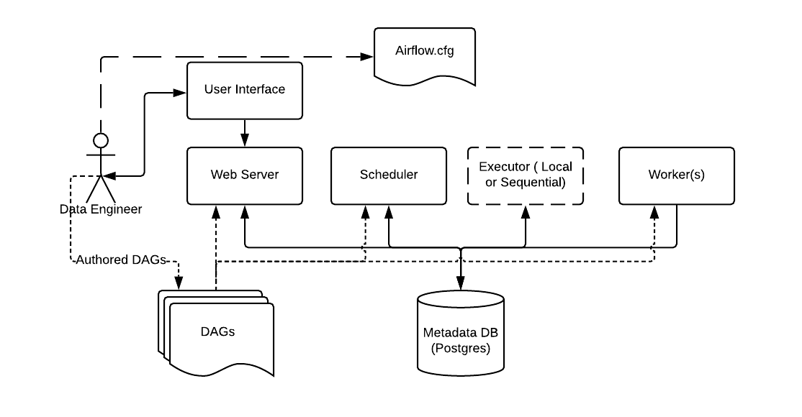

# What is Apache Airflow?
Apache Airflow is an open-source platform for developing, scheduling, and monitoring batch-oriented workflows. Airflow’s extensible Python framework enables you to build workflows connecting with virtually any technology. A simple web interface helps manage the state of your workflows. Airflow is deployable in many ways, varying from a single process on your laptop to a distributed setup to support even the biggest workflows.

Fun Fact! Apache Airflow was created by AirBNB in 2014 to manage their increasingly complex workflows. From the beginning, the project was created as an open-source project, becoming an apache incubation project and a top-level apache software foundation project in 2019.

## Workflows? The basics of DAG
In Airflow, we often manage many workflows. These workflows are called DAGs, or Directed Acyclic Graphs. Basically, DAGs are collections of tasks which reflect their relationships and dependencies. DAGs cannot contain task loops, for example "A -> B -> C" is acceptible, but "A -> B -> C -> A" is not.

Tasks are units of work in a DAG. It is represented as a node in the DAG graph, and these tasks have dependencies between each other. Since each task has its own specific goal, each task will use a different method to achieve its goal. These methods are called an operators. There are many types of operators in Airflow: BashOperator, PythonOperator, CustomizedOperator, etc,.

To summarize, the operator determines what will be done, the task implements an operator by defining specific values for that operator, and DAG is a collection of tasks which reflect their relationships and dependencies. 

## Apache Airflow's Architecture:

**Data Engineers** create and manage the DAGs through the **User Interface** of the **Web Server**. The created DAGs are also visible to the **Scheduler** and **Workers**. These components work together to complete the lifecycle of a DAG.

- DAGs refers to the DAG files containing Python code, representing the data pipelines to be run by Airflow. The location of these files is specified in the Airflow configuration file, but they need to be accessible by the Web Server, Scheduler, and Workers.
- The Worker(s) are separate processes which also interact with the other components of the Airflow architecture and the metadata repository.
- Web Server and Scheduler: The Airflow web server and Scheduler are separate processes run (in this case) on the local machine and interact with the database mentioned above.
    - The Executor is shown separately above, since it is commonly discussed within Airflow and in the documentation, but in reality it is NOT a separate process, but run within the Scheduler.
- Metadata Database: Airflow uses a SQL database to store metadata about the data pipelines being run. In the diagram above, this is represented as Postgres which is extremely popular with Airflow. Alternate databases supported with Airflow include MySQL.
- airflow.cfg is the Airflow configuration file which is accessed by the Web Server, Scheduler, and Workers.

# 1 First DAG